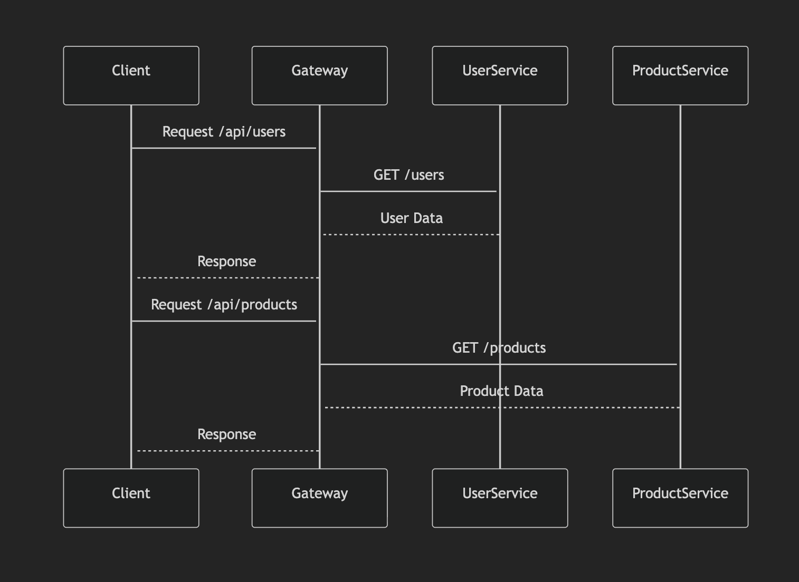
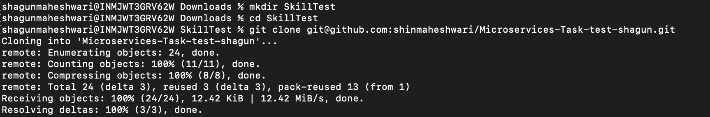
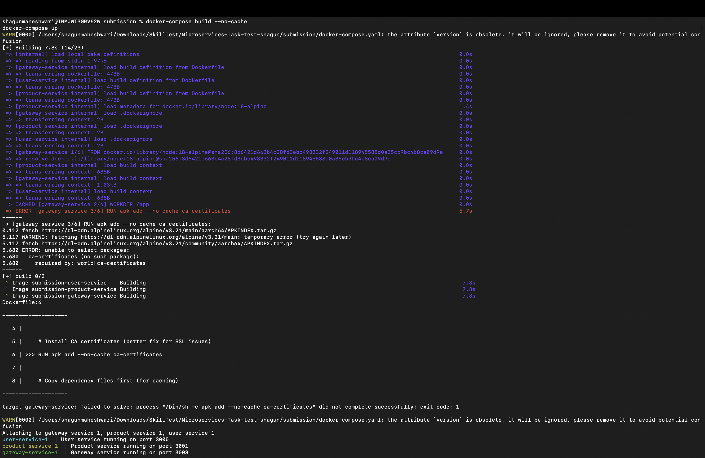
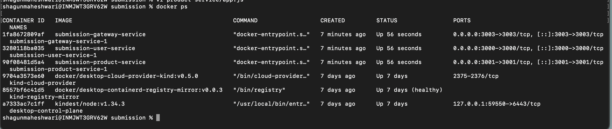
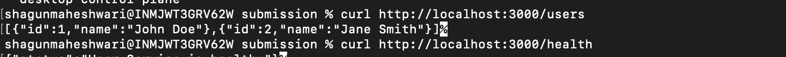
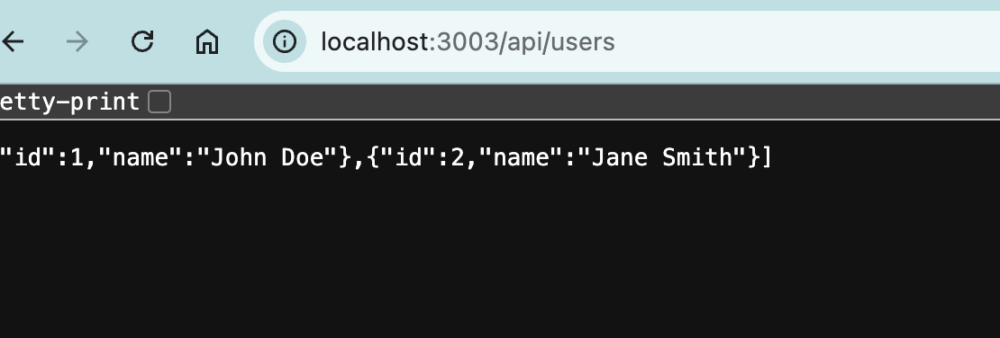
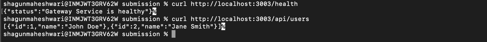
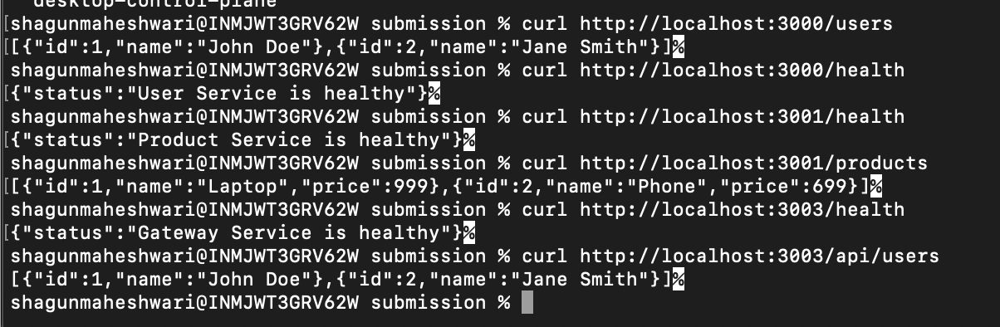

# 🚀 Microservices Containerization Project

---

## 📌 Overview

This project demonstrates how to containerize a Node.js-based microservices application using Docker and Docker Compose.

The application consists of:

- ✅ User Service → Port 3000
- ✅ Product Service → Port 3001
- ✅ Gateway Service → Port 3003

---

## 🧱 Project Structure

```
submission/
├── user-service/
│   ├── Dockerfile
│   ├── app.js
│   └── package.json
├── product-service/
│   ├── Dockerfile
│   ├── app.js
│   └── package.json
├── gateway-service/
│   ├── Dockerfile
│   ├── app.js
│   └── package.json
├── docker-compose.yml
└── README.md
```

---

## 🧠 Application Flow



### 🔁 Flow Explanation

1. User sends request to Gateway
2. Gateway routes request:
   - `/api/users` → User Service
   - `/api/products` → Product Service
3. Backend services process request
4. Gateway returns response to user

✅ Communication happens via Docker network using service names:

```
http://user-service:3000
http://product-service:3001
```

---

## ⚙️ Prerequisites

- Docker
- Docker Compose

---

## 🐳 Install Docker (if not installed)

### ✅ Ubuntu

```bash
sudo apt update
sudo apt install docker.io -y
sudo systemctl start docker
sudo systemctl enable docker
```

Verify:

```bash
docker --version
```

---

### ✅ macOS (Homebrew)

```bash
brew install --cask docker
```

Then start Docker Desktop.

---

## 🧰 Install Docker Compose

### ✅ Ubuntu

```bash
sudo apt install docker-compose -y
```

Verify:

```bash
docker-compose --version
```

---

## 🚀 Setup Instructions

1. **Clone the repository:**

```bash
git clone https://github.com/<your-username>/Microservices-Task.git
cd submission
```



2. **Build and start all services:**

```bash
docker-compose up --build
```



---

## ✅ Verify Running Containers

```bash
docker ps
```

You should see:

- user-service ✅
- product-service ✅
- gateway-service ✅



---

## 🌐 Access Services

### Direct Access

#### **User Service (Port 3000)**

```bash
curl http://localhost:3000/users
```



#### **Product Service (Port 3001)**

```bash
curl http://localhost:3001/products
```


---

### Gateway Access (Main Entry Point - Port 3003)

#### **Users API**

```
http://localhost:3003/api/users
```





#### **Products API**

```
http://localhost:3003/api/products
```


---

## 🧪 Testing

### Using curl - Complete Testing

```bash
# User Service - Direct Access
curl http://localhost:3000/users
curl http://localhost:3000/health

# Product Service - Direct Access
curl http://localhost:3001/products
curl http://localhost:3001/health

# Gateway Service - Routing
curl http://localhost:3003/health
curl http://localhost:3003/api/users
curl http://localhost:3003/api/products
```



---

## 🛠 Troubleshooting

### ❌ Containers not starting

```bash
docker-compose logs
```

---

### ❌ Restart services

```bash
docker-compose down
docker-compose up --build
```

---

### ❌ Port already in use

```bash
sudo lsof -i :3000
kill -9 <PID>
```

---

### ❌ Docker not running

```bash
sudo systemctl start docker
```

---

## ⚡ Docker Best Practices Used

- ✅ Lightweight base image (`node:18-alpine`)
- ✅ Production dependencies only
- ✅ Optimized layer caching
- ✅ Service-to-service communication using Docker networking
- ✅ Clean and modular service structure

---

## ⚠️ Challenges Faced

### 1. npm SSL Certificate Issue

- **Error:** `UNABLE_TO_GET_ISSUER_CERT_LOCALLY`
- **✅ Solution:**
  - Installed `ca-certificates`
  - Disabled strict SSL temporarily

---

### 2. npm ci Failure

- **Error:** Requires `package-lock.json`
- **✅ Solution:** Replaced with:

```bash
npm install --omit=dev
```

---

### 3. Service Communication Failure

- **Issue:** Using `localhost` between containers
- **✅ Solution:** Used service names:

```
http://user-service:3000
http://product-service:3001
```

---

### 4. Missing Routes (Cannot GET /)

- **Issue:** Root route not defined
- **✅ Solution:** Added `/` endpoint for better testing

---

### 5. Port Conflicts

- **Issue:** Services not starting due to port usage
- **✅ Solution:** Verified and freed ports

---

## ✅ Conclusion

- Successfully containerized Node.js microservices
- Used Docker Compose for orchestration
- Enabled inter-service communication
- Verified all services via API endpoints
- Demonstrated proper gateway routing and service discovery

---

## 📝 Author

**Shagun Maheshwari**

---

## 📸 Screenshots Guide

| # | Description | File |
|---|---|---|
| 1 | Microservices Architecture Diagram | `01-architecture-diagram.png` |
| 2 | Docker Compose Build Output | `02-docker-compose-build.png` |
| 3 | Docker PS - Running Containers | `03-docker-ps-output.png` |
| 4 | API Testing with curl | `04-api-testing-curl.png` |
| 5 | Gateway Users API Response | `05-gateway-users-api.png` |
| 6 | Gateway Health & Users API | `06-gateway-health-and-users-api.png` |
| 7 | Git Clone Process | `07-git-clone-process.png` |
| 8 | Gateway Products API Browser | `08-gateway-products-api-browser.png` |
| 9 | Product Service Direct Access | `09-product-service-direct-access.png` |
| 10 | Gateway Users API Browser | `10-gateway-users-api-browser.png` |
| 11 | User Service Direct Access | `11-user-service-direct-access.png` |
